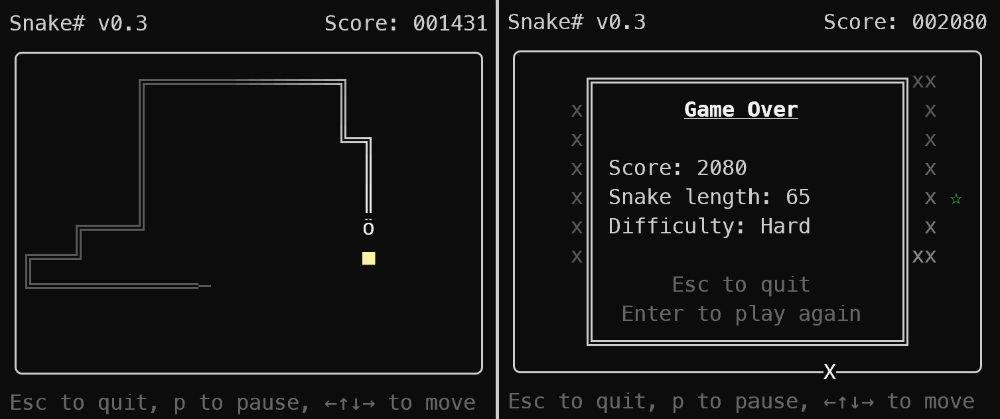

# Snake# 

**Snake#** is a basic TUI implementation of the game *Snake*, written in C# with
.NET Core 10.

## Gameplay

Use the arrow keys or WASD to move the Snake. If you collide with yourself or
the boundary the snake dies and the game ends.

Eat the coloured fruits that appear at random positions to grow your snake and
gain points. How many points you get for eating a fruit depends on the current
length of your snake &mdash; the longer the snake the more points you get for
each fruit you eat.

As the snake grows it will also start to move faster on its own. You can hasten
the snake by repeatedly pressing the button for the direction you're going in
(or by holding the button down).

You can pause the game at any time by pressing P, and then resume by pressing
Enter. Press Escape to quit the game.

### Difficulty levels

#### Easy

On *Easy*, the snake will start out moving very slowly and only get a little
faster as it grows. The snake will stop when it reaches a boundary instead of
crashing into it and dying. It will also refuse to turn back on itself (which
would otherwise result in the snake colliding with itself).

### Medium

On *Medium*, the snake will start out moving slowly and get fairly fast as it
grows longer (it will be at its fastest when it has length 100 or more). The
snake will die if it collides with a boundary, but it will refuse to turn back
on itself (which would otherwise result in the snake colliding with itself).

### Hard

On *Hard*, the snake will start out moving fairly quickly and become even faster
as it grows, getting much faster than it ever does on *Easy* or *Medium*. The
snake will die if it collides with a boundary and will happily turn back on
itself if told to do so, even though that results in it colliding with itself
(and consequently dying).

## Building etc.

### Prerequisites
You'll need [.NET 10](https://dotnet.microsoft.com/) to build, and the `dotnet`
executable on your PATH.

### Interpreted run
To run straight from source, use `dotnet run` inside the project directory.

### Building
To build the project for debugging, just run
`dotnet build`.

To build a release, run `dotnet publish -c Release`.
