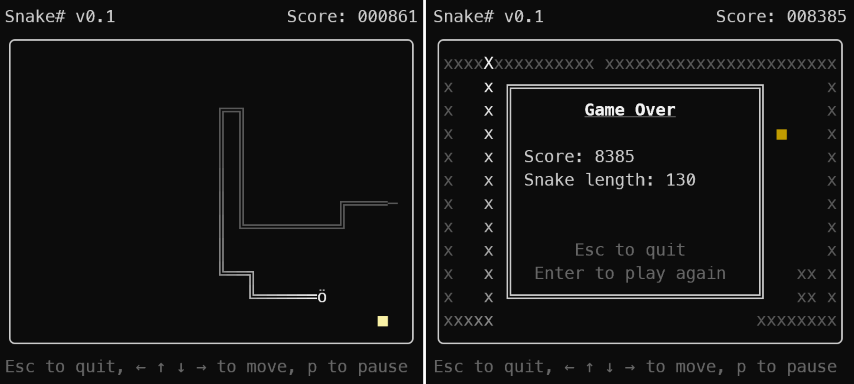

# Snake# 

**Snake#** is a basic TUI implementation of the game *Snake*, written in C# for
.net Core 10.

I wrote this mostly on a Saturday just for fun to try out some C#. As this was
my first time writing any C#, the code is probably lacking some idiomaticity and
could be improved in many places. Feedback is of course welcome. I may or may
not come back to tweak this further in the future.

## Gameplay

Use the arrow keys or WASD to move the Snake. If you collide with yourself or
the boundary the snake dies and the game ends.

Eat the coloured fruits that appear at random positions to grow your snake and
gain points. How many points you get for eating a fruit depends on the current
length of your snake &mdash; the longer the snake the more points you get for
each fruit you eat.

As the snake grows it will also start to move faster on its own. You can hasten
the snake by repeatedly pressing the button for the direction you're going in
(or by holding the button down).

You can pause the game at any time by pressing P, and then resume by pressing
Enter. Press Escape to quit the game.

## Building etc.

### Prerequisites
You'll need [.NET 10](https://dotnet.microsoft.com/) to build, and the `dotnet`
executable on your PATH.

Target machines need to have the .NET 10 runtime installed to run the app,
unless you add the `--self-contained --runtime` flags to the build command.

### Interpreted run
To run straight from source, use `dotnet run` inside the project directory.

### Building
To build the project for debugging, just run
`dotnet build ./SnakeSharp.sln`.

To build a release, run `dotnet publish -c Release ./SnakeSharp.sln`.

